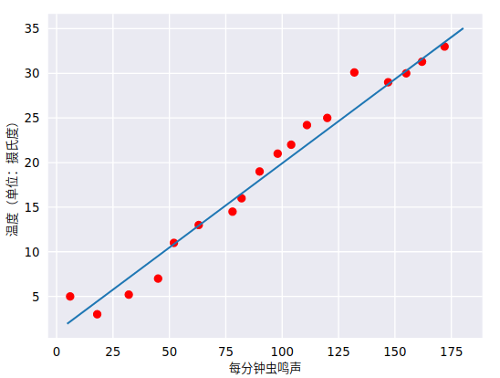
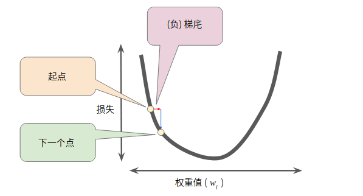

### [TensorFlow](tensorflow/readme.md)

### [PyTorch](pytorch/readme.md)

### [Keras](keras/readme.md)

------

# [machine learning crash course](https://developers.google.com/machine-learning/crash-course)

---

##  Introduction to Machine Learning

- 机器学习系统通过学习如何组合输入信息来对从未见过的数据做出有用的预测。

- **标签**是我们要预测的事物，即简单线性回归中的 `y` 变量

- **特征**是输入变量，即简单线性回归中的 `x` 变量。简单的机器学习项目可能会使用单个特征，而比较复杂的机器学习项目可能会使用数百万个特征，按如下方式指定：

  {x1,x2,...xN}

  在垃圾邮件检测器示例中，特征可能包括：

  - 电子邮件文本中的字词
  - 发件人的地址
  - 发送电子邮件的时段
  - 电子邮件中包含“一种奇怪的把戏”这样的短语。

- **样本**是指数据的特定实例：**x**。（我们采用粗体 **x** 表示它是一个矢量。）我们将样本分为以下两类：

  - 有标签样本 **有标签样本**同时包含特征和标签
  - 无标签样本 **无标签样本**包含特征，但不包含标签

- 模型定义了特征与标签之间的关系。

  - **训练**表示创建或**学习**模型。也就是说，您向模型展示有标签样本，让模型逐渐学习特征与标签之间的关系。
  - **推断**表示将训练后的模型应用于无标签样本。也就是说，您使用训练后的模型来做出有用的预测 (`y'`)。例如，在推断期间，您可以针对新的无标签样本预测 `medianHouseValue`。

- **回归**模型可预测连续值。例如，回归模型做出的预测可回答如下问题：

  - 加利福尼亚州一栋房产的价值是多少？
  - 用户点击此广告的概率是多少？

- **分类**模型可预测离散值。例如，分类模型做出的预测可回答如下问题：

  - 某个指定电子邮件是垃圾邮件还是非垃圾邮件？
  - 这是一张狗、猫还是仓鼠图片？

## Descending into ML

- **线性回归**是一种找到最适合一组点的直线或超平面的方法

  

- 事实上，虽然该直线并未精确无误地经过每个点，但针对我们拥有的数据，清楚地显示了鸣叫声与温度之间的关系。只需运用一点代数知识，您就可以将这种关系写下来，如下所示：

  y=mx+b

  其中：

  - y 指的是温度（以摄氏度表示），即我们试图预测的值。
  - m 指的是直线的斜率。
  - x 指的是每分钟的鸣叫声次数，即输入特征的值。
  - b 指的是 y 轴截距。

  按照机器学习的惯例，您需要写一个存在细微差别的模型方程式：

  y′=b+w1x1

  其中：

  - y′ 指的是预测[标签](https://developers.google.com/machine-learning/crash-course/framing/ml-terminology#labels)（理想输出值）。
  - b 指的是偏差（y 轴截距）。而在一些机器学习文档中，它称为 w0。
  - w1 指的是特征 1 的权重。权重与上文中用 m 表示的“斜率”的概念相同。
  - x1 指的是[特征](https://developers.google.com/machine-learning/crash-course/framing/ml-terminology#features)（已知输入项）。

  要根据新的每分钟的鸣叫声值 x1 **推断**（预测）温度 y′，只需将 x1 值代入此模型即可。

- 简单来说，**训练**模型表示通过有标签样本来学习（确定）所有权重和偏差的理想值。在监督式学习中，机器学习算法通过以下方式构建模型：检查多个样本并尝试找出可最大限度地减少损失的模型；这一过程称为**经验风险最小化**。

- 损失是对糟糕预测的惩罚。也就是说，**损失**是一个数值，表示对于单个样本而言模型预测的准确程度。如果模型的预测完全准确，则损失为零，否则损失会较大。训练模型的目标是从所有样本中找到一组平均损失“较小”的权重和偏差。

- **平方损失**：一种常见的损失函数

  - 线性回归模型使用的是一种称为**平方损失**（又称为 **L2 损失**）的损失函数

  - ```
    = the square of the difference between the label and the prediction
    = (observation - prediction(x))2
    = (y - y')2
    ```

- **均方误差** (**MSE**) 指的是每个样本的平均平方损失。要计算 MSE，请求出各个样本的所有平方损失之和，然后除以样本数量：
  $$
  MSE = \frac{1}{N} \sum_{(x,y)\in D} (y - prediction(x))^2
  $$

  > 其中：
  >
  > - (x,y)指的是样本，其中
  >   - x 指的是模型进行预测时使用的特征集（例如，温度、年龄和交配成功率）。
  >   - y 指的是样本的标签（例如，每分钟的鸣叫次数）。
  > - prediction(x) 指的是权重和偏差与特征集 x 结合的函数。
  > - D 指的是包含多个有标签样本（即 (x,y)）的数据集。
  > - N 指的是 D 中的样本数量。

## Reducing Loss

- 对于我们一直在研究的回归问题，所产生的损失与 w1 的图形始终是凸形。换言之，图形始终是碗状图


- 凸形问题只有一个最低点；即只存在一个斜率正好为 0 的位置。这个最小值就是损失函数收敛之处。

- 梯度下降法的第一个阶段是为 w1 选择一个起始值（起点）。起点并不重要；因此很多算法就直接将 w1 设为 0 或随机选择一个值。

- 然后，梯度下降法算法会计算损失曲线在起点处的梯度。简而言之，**梯度**是偏导数的矢量；它可以让您了解哪个方向距离目标“更近”或“更远”。请注意，损失相对于单个权重的梯度（如图 3 所示）就等于导数。

- 梯度是一个矢量，梯度始终指向损失函数中**增长**最为迅猛的方向。梯度下降法算法会沿着**负梯度**的方向走一步，以便尽快降低损失。**梯度下降法依赖于负梯度**，然后，梯度下降法会重复此过程，逐渐接近最低点。

- ​

  

- 梯度下降法算法用梯度乘以一个称为**学习速率**（有时也称为**步长**）的标量，以确定下一个点的位置。例如，如果梯度大小为 2.5，学习速率为 0.01，则梯度下降法算法会选择距离前一个点 0.025 的位置作为下一个点。

- **超参数**是编程人员在机器学习算法中用于调整的旋钮。大多数机器学习编程人员会花费相当多的时间来调整学习速率。如果您选择的学习速率过小，就会花费太长的学习时间；相反，如果您指定的学习速率过大，下一个点将永远在 U 形曲线的底部随意弹跳，就好像量子力学实验出现了严重错误一样。

- 每个回归问题都存在一个[Goldilocks_principle](https://wikipedia.org/wiki/Goldilocks_principle)学习速率，理想的学习速率：

- > 一维空间中的理想学习速率是 1f(x)″（f(x) 对 x 的二阶导数的倒数）。
  >
  > 二维或多维空间中的理想学习速率是[海森矩阵](https://wikipedia.org/wiki/Hessian_matrix)（由二阶偏导数组成的矩阵）的倒数。
  >
  > 广义凸函数的情况则更为复杂。

- SGD 随机梯度下降。在梯度下降法中，**批量**指的是用于在**单次迭代**中计算梯度的样本总数。实际上，批量大小越大，出现冗余的可能性就越高。 如果我们可以通过更少的计算量得出正确的平均梯度，会怎么样？通过从我们的数据集中随机选择样本，我们可以通过小得多的数据集估算（尽管过程非常杂乱）出较大的平均值。 **随机梯度下降法** (**SGD**) 将这种想法运用到极致，它每次迭代只使用一个样本（批量大小为 1）。如果进行足够的迭代，SGD 也可以发挥作用，但过程会非常杂乱。“随机”这一术语表示构成各个批量的一个样本都是随机选择的。**小批量随机梯度下降法**（**小批量 SGD**）是介于全批量迭代与 SGD 之间的折衷方案。小批量通常包含 10-1000 个随机选择的样本。小批量 SGD 可以减少 SGD 中的杂乱样本数量，但仍然比全批量更高效。

  ## Generalization

- 过拟合模型在训练过程中产生的损失很低，但在预测新数据方面的表现却非常糟糕;过拟合是由于模型的复杂程度超出所需程度而造成的，机器学习的基本冲突是适当拟合我们的数据，但也要尽可能简单地拟合数据。

- 机器学习的目标是对从真实概率分布（已隐藏）中抽取的新数据做出良好预测。遗憾的是，模型无法查看整体情况；模型只能从训练数据集中取样。

- 奥卡姆剃刀定律在机器学习方面的运用如下：

  > 机器学习模型越简单，良好的实证结果就越有可能不仅仅基于样本的特性。

- 以下三项基本假设阐明了泛化：

  - 我们从分布中随机抽取**独立同分布** (**i.i.d**) 的样本。换言之，样本之间不会互相影响。（另一种解释：i.i.d. 是表示变量随机性的一种方式）。
  - 分布是**平稳的**；即分布在数据集内不会发生变化。
  - 我们从**同一分布**的数据划分中抽取样本。

- 总结

  - 如果某个模型尝试紧密拟合训练数据，但却不能很好地泛化到新数据，就会发生过拟合。
  - 如果不符合监督式机器学习的关键假设，那么我们将失去对新数据进行预测这项能力的重要理论保证。
  - **请勿对测试数据进行训练。**

## Validation


- 在这一经过改进的工作流程中：

  1. 选择在验证集上获得最佳效果的模型。
  2. 使用测试集再次检查该模型。

  该工作流程之所以更好，原因在于它暴露给测试集的信息更少。

> 提示
>
> 不断使用测试集和验证集会使其逐渐失去效果。也就是说，您使用相同数据来决定超参数设置或其他模型改进的次数越多，您对于这些结果能够真正泛化到未见过的新数据的信心就越低。请注意，验证集的失效速度通常比测试集缓慢。
>
> 如果可能的话，建议您收集更多数据来“刷新”测试集和验证集。重新开始是一种很好的重置方式。

## Representation

- 将原始数据映射到特征

  - **特征工程** 指的是将原始数据转换为特征矢量。进行特征工程预计需要大量时间。

  - 映射数值

    - 机器学习模型根据浮点值进行训练，因此整数和浮点原始数据不需要特殊编码

  - 映射字符串值

    - 模型无法通过字符串值学习规律，因此您需要进行一些特征工程来将这些值转换为数字形式

    > 1. 首先，为您要表示的所有特征的字符串值定义一个**词汇表**。对于 `street_name` 特征，该词汇表中将包含您知道的所有街道。
    >
    >    **注意**：所有其他街道都可以归入一个笼统的“其他”类别，该类别称为 **OOV**（未收录到词汇表中）桶。
    >
    > 2. 然后，使用该词汇表创建一个**独热编码**，用于将指定字符串值表示为二元矢量。在该矢量（与指定的字符串值对应）中：
    >
    >    - 只有一个元素设为 `1`。
    >    - 其他所有元素均设为 `0`。
    >
    >    该矢量的长度等于词汇表中的元素数。

  - 映射分类（枚举）值 : 分类特征具有一组离散的可能值

- 良好特征的特点

  - 避免很少使用的离散特征值:良好的特征值应该在数据集中出现大约 5 次以上。这样一来，模型就可以学习该特征值与标签是如何关联的。
  - 最好具有清晰明确的含义:每个特征对于项目中的任何人来说都应该具有清晰明确的含义。
  - 不要将“神奇”的值与实际数据混为一谈:良好的浮点特征不包含超出范围的异常断点或“神奇”的值
  - 考虑上游不稳定性: 特征的定义不应随时间发生变化。

- 清理数据

  - 缩放特征值

    > - **缩放**是指将浮点特征值从自然范围（例如 100 到 900）转换为标准范围（例如 0 到 1 或 -1 到 +1）。如果某个特征集只包含一个特征，则缩放可以提供的实际好处微乎其微或根本没有。不过，如果特征集包含多个特征，则缩放特征可以带来以下优势：
    >   - 帮助梯度下降法更快速地收敛。
    >   - 帮助避免“NaN 陷阱”。在这种陷阱中，模型中的一个数值变成 [NaN](https://wikipedia.org/wiki/NaN)（例如，当某个值在训练期间超出浮点精确率限制时），并且模型中的所有其他数值最终也会因数学运算而变成 NaN。
    >   - 帮助模型为每个特征确定合适的权重。如果没有进行特征缩放，则模型会对范围较大的特征投入过多精力。

  - 不需要对每个浮点特征进行完全相同的缩放。即使特征 A 的范围是 -1 到 +1，同时特征 B 的范围是 -3 到 +3，也不会产生什么恶劣的影响。不过，如果特征 B 的范围是 5000 到 100000，您的模型会出现糟糕的响应。

  - 缩放常见方法

    > 要缩放数字数据，一种显而易见的方法是将 [最小值，最大值] 以线性方式映射到较小的范围，例如 [-1，+1]。
    >
    > 另一种热门的缩放策略是计算每个值的 Z 得分。Z 得分与距离均值的标准偏差数相关。换而言之：
    >
    > scaledvalue=(value−mean)/stddev.
    >
    > 例如，给定以下条件：
    >
    > - 均值 = 100
    > - 标准偏差 = 20
    > - 原始值 = 130
    >
    > 则：
    >
    > ```
    >   scaled_value = (130 - 100) / 20
    >   scaled_value = 1.5
    >
    > ```
    >
    > 使用 Z 得分进行缩放意味着，大多数缩放后的值将介于 -3 和 +3 之间，而少量值将略高于或低于该范围。

  - 处理极端离群值

    - [离群值](https://baike.baidu.com/item/%E7%A6%BB%E7%BE%A4%E5%80%BC/311974?fr=aladdin) : 离群值(outlier)，也称逸出值，是指在数据中有一个或几个数值与其他[数值](https://baike.baidu.com/item/%E6%95%B0%E5%80%BC/2013853)相比差异较大。

    - 如何最大限度降低这些极端离群值的影响？

      > 一种方法是对每个值取对数

  - 分箱

    - 分箱边界

      > 为了简单起见，我们在纬度样本中使用整数作为分箱边界。如果我们需要更精细的解决方案，我们可以每隔 1/10 个纬度拆分一次分箱边界。添加更多箱可让模型从纬度 37.4 处学习和维度 37.5 处不一样的行为，但前提是每 1/10 个纬度均有充足的样本可供学习。
      >
      > 另一种方法是按[分位数](https://wikipedia.org/wiki/Quantile)分箱，这种方法可以确保每个桶内的样本数量是相等的。按分位数分箱完全无需担心离群值。

  - 清查

    > 在现实生活中，数据集中的很多样本是不可靠的，原因有以下一种或多种：
    >
    > - **遗漏值。** 例如，有人忘记为某个房屋的年龄输入值。
    > - **重复样本。** 例如，服务器错误地将同一条记录上传了两次。
    > - **不良标签。** 例如，有人错误地将一颗橡树的图片标记为枫树。
    > - **不良特征值。** 例如，有人输入了多余的位数，或者温度计被遗落在太阳底下。
    >
    > 一旦检测到存在这些问题，您通常需要将相应样本从数据集中移除，从而“修正”不良样本。
    >
    > - 要检测遗漏值或重复样本，您可以编写一个简单的程序。
    > - 检测不良特征值或标签可能会比较棘手

    ​

  - 了解数据

    > - 遵循以下规则：
    >
    >   - 记住您预期的数据状态。
    >   - 确认数据是否满足这些预期（或者您可以解释为何数据不满足预期）。
    >   - 仔细检查训练数据是否与其他来源（例如信息中心）的数据一致。
    >
    >   像处理任何任务关键型代码一样谨慎处理您的数据。良好的机器学习依赖于良好的数据。


## Feature Crosses

- **特征组合**是指两个或多个特征相乘形成的**合成特征**。特征的相乘组合可以提供超出这些特征单独能够提供的预测能力。
- ​


