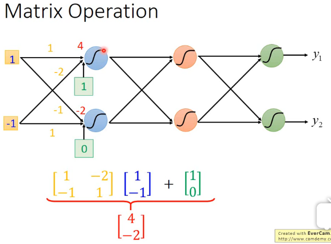

# 李宏毅机器学习(2017)

[TOC]

## Introduction of ML

- ML : Looking for a function from data

- Application

  - Speech Recognition
  - Image Recognition
  - Play Go
  - Dialogue System

- FrameWork

  - step1:a set of function 假设空间（space of model）
  - step2:traning data -> goodness of fucntion f,pick the best function as f
  - step3:testing

- Learning map

  - supervisied learning 

    - regression = predict a series of output
    - classification =  output label
      - binary : spam filter,tumour classification
      - multi-calss : text classification
    - model : linear model,no-linear model(deep learning and svm decision tree ,knn et.)

  - semi-supervisied learning

  - unsupervisied learning

  - transfer learning

  - reinforcement learning

    - difference with supervisied learning

      > supervisied learning : learning from teacher
      >
      > reinforcement learning : learning from critics
      >
      > Alpha go = supervisied learning + reinforcement learning

## Regression

- Output a scalar

  - eg : stock market forecast , slef-drive car , recommandation system

- Application Example : estimating the combat power (cp) of a pokemon after evolution预测宝可梦进化后的战力

  - step1 :model 

    - a set of fuction(f1,f2,f3,f4....)
    - y=wx+b linear model

  - step2 :goodness of function 

    - y^=wx+b

    - L(f) = L(w,b) = loss function : compute the loss of output and y^

    - $$
      L(f)=\sum {_1^n}(y-(wx+b))^2
      $$

  - step3:pick the best function

    - compute the minimum of  loss function

  - $$
    f^*=argminL(f)
    $$

    $$
    w^*,b^*=argminL(f)
    $$

    $$
    w^*,b^*=argminL(f)=argmin(\sum {_1^n}(y-(wx+b))^2)
    $$

    - gradient descent 

      > consider loss function L(w) with one parameter w [w,b]:
      >
      > pick an inital value w^0 [delay on local if there is a  minimum or global minumum ]
      >
      > compute 
      > $$
      > \dfrac{dL}{dw}|w=w^{0}
      > $$
      > update makes L(f) smaller [condider the function type(convex function ,nun-convex function)]
      > $$
      > W^{n+1}=w^{n}-\alpha\dfrac {dL}{1w}
      > $$
      >  the learning rate
      > $$
      > \alpha
      > $$
      >

  - step4:testing (generalization)

  - step5:model selection

    > a more complex model can lower error on trainning data,but
    >
    > a more complex model does not always lead to better performance on testing data ( **overfitting**)

- Overfitting

  - concept

    > model has a performance good on trianing data **but **bad performance on testing data
    >
    > it means model is so complex , so we need to simplify the model and decrease the loss of model

  - resolution

    > redesign the model
    >
    > add regularization , minimizing the L(f) means minimize the regularization too
    >
    > - $$
    >   regularization=\lambda\sum(wx)^2
    >   $$
    >
    > - smaller wi means smooth function , we believe smoother function is more likely to bt correct
    >   $$
    >   L(f)=\sum {_1^n}(y-(wx+b))^2+regularization
    >   $$
    >   ​
    >
    > regularization meas : Loss function not only a minimum of loss,but also smooth
    >
    > ​

## Where does the error come from?

- error com from **bias** and **variance**

  > **bias** decides the mean of x
  >
  > **variance** decides the distribution  of x

  - assume the mean of x 

  - $$
    \mu=\frac{1}{n}\sum{x_i}
    $$

  - assume the variance of x 
    $$
    \sigma^2=\frac{1}{n}\sum{(x_i-\mu)^2}
    $$

  - m = estimator of mean ; s^2= estimator of variance;we use m and s^2 to estimate 

- bias vs variance

  - e1=error from bias
  - e2=error from variance
  - large e1 means **underfitting**
  - large e2 means **overfitting**

- resolution

  - for bias (underfitting)
    - redesign model
      - add more features
      - a more complex model
      - ...
  - for variance (overfitting)
    - more data (vary effective,but not practical)
    - regularization (vary common method)

- model selection

  - there is usually a trade-off between bias and variance.
  - select a  model that balances two kind of error to minimize total error.

- cross validation

  - data=trainning set + [validation set] + testing data
  - training set+validation set -> model1,model2,model3....
    - trainning set for trainning
    - validation set for choosing model
  - testing model 

- N-fold cross validation

## Gradient Descent

- Tuning the learning rate
  - set the learning rate carefully
  - plot "Loss-Parameter updates "
  - normally : learning rate is fixed , but also can be dynamic , eg : α=g(step)
  - **Adam** 、**Adagrad**  dunamic α
  - **Batch GD** 、**SGD**、**Mini-batch Gradient Descent**   fixed α
- Larger gradient,larger steps?
  - asd
- SGD
  - pick an example    [gradient descent is over all trainning data]
  - excute the loss and gradient descent
- Feature  Scaling
  - make the different features have the same scaling
  - for each dimension i,excute min_i,max_i,value=x_i/(max_i-min_i)
- Taylor Series
  - single variable taylor series
  - multivariable taylor series

## Classification

- trainning data for classification : (x,y)

- binary classification | multi classification 

  - give an x, which class does it belong to:

- $$
  P( C_{i}|x) =\dfrac {P(x|Ci)\cdot P( C_{i}) } {\sum P(x|Ci)\cdot P( C_{i}) }
  $$

  - Generative model 
    $$
    P(x)=\sum(P(x|Ci)\cdot P( C_{i}))
    $$

    - prior experence : P(Ci)
    - probability from class : P(x|Ci)

- Gaussian distribution

  - if data satisfied the gaussian distribution, than we can use **maximum likelihood method**  to caculate the **mean **and **variance**,which make the probability of data maxmum.
  - Maxmum Likelihood function 

  $$
  L(w,b)=f_{w,b}(x^1)\cdot f_{w,b}(x^2)\cdot f_{w,b}(x^3).....
  $$

## Logistic Regression

- if P>0.5 output C1,else output C2

- P(C1|x,w,b)=σ(z)

- z=wx+b=∑wixi+b

- σ 函数是sigmoid函数

- $$
  σ(z) = \frac{1}{1+exp(-z)}
  $$

- Maxmum Likelihood function 

$$
L(w,b)=f_{w,b}(x^1)\cdot f_{w,b}(x^2)\cdot f_{w,b}(x^3).....
$$

- goal function

$$
w*,b*=argmax _{w,b}L(w,b)=argmin_{w,b}-lnL(w,b)
$$

- simplify the function 
  $$
  -lnL(w,b)=lnf_{w,b}(x^1)+lnf_{w,b}(x^2)lnf_{w,b}(x^3)+.....
  $$

  $$
  y:number 1 for class 1,number 0 for class 0
  $$

  $$
  -lnL(w,b)=\sum_n - [ylnf_{w,b}(x)+(1-y)ln(1-f_{w,b}(x))]
  $$

  $$
  C(f(x),y)=- [ylnf_{w,b}(x)+(1-y)ln(1-f_{w,b}(x))]
  $$

  - Cross entropy betwween two bernoulli distribution	
    - distribution p  
      - p(x=1)=y
      - p(x=0)=1-y
    - distribution q 
      - q(x=1)=f(x)
      - q(x=0)=1-f(x)
    - **cross entropy **is better than **square error**

$$
logistc - regression简化形式 ： L(f)=\sum_n C(f(x),y)
$$

$$
Linear - regression  ： L(f)=\frac{1}{2m} \sum (f(x)-y)^2
$$

 -   -	 usually ,discriminative model is better than genarative model

 -  multi-class classification 

     -  **softmax**

     -  $$
        P(y|x)=\sigma (x)
        $$

-	limit of logistic regression

  -	feature transformation
  -	cascading logistic regression

## Brief Introduction of Deep Learning

**neural network=input layer + hidden layer + output layer**

- step 1 neural network

  - given **a network structure**   ,define **a function set**

    - fully connnected feedforward network

  - parameter \theta

  - output of pre-layer  is the input of post-layer

  - **matrix operation** between layers 

    

  - conclusion : **a neural network is a series matrix operation**

  - **GPU** can accelarate the matrix operation

  - Hidden layers : feature extractor replacing feature engineering

  - Output layer == Multi-class Classifier softmax

- step 2 

